<p align="center">
  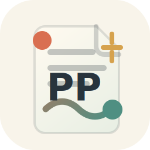
</p>

<h1 align="center">PP Article Library</h1>

<p align="center">
  本地优先的文献阅读工作台：找文献、读 PDF、AI 速记、分类整理、引用沉淀，都在同一页完成。<br />
  A local-first research workbench for PDFs, AI notes, categories, and citation-ready writing context.
</p>

<p align="center">
  <a href="https://github.com/myppqk88/PP-Article-Library/releases"></a>
  
  
  
</p>

<p align="center">
  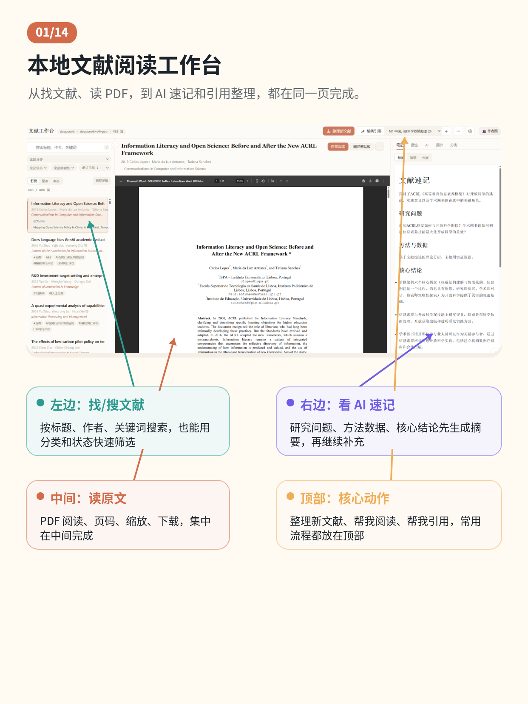
</p>

## 中文

### 它是做什么的

PP Article Library 是一个给个人研究使用的本地文献系统。你把 PDF 放进自己的文件夹，它会帮你整理文献、读取全文、生成 AI 笔记、维护分类、保存便签和摘抄，并把某篇文献为什么能被你的论文引用记录到 citation 文件里。

它不是云盘，也不是在线数据库。你的 PDF、笔记、API key、写作上下文和索引表默认都只在你的电脑上。

### 功能一览

| 阅读与 AI 笔记 | Citation 写作上下文 |
| --- | --- |
| 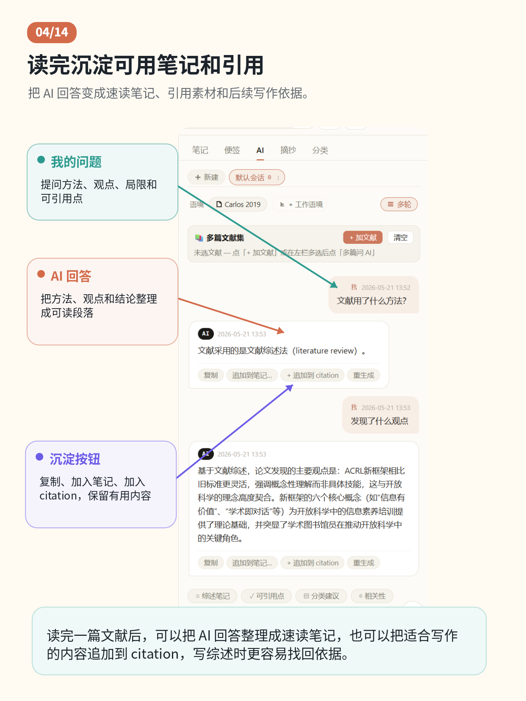 | 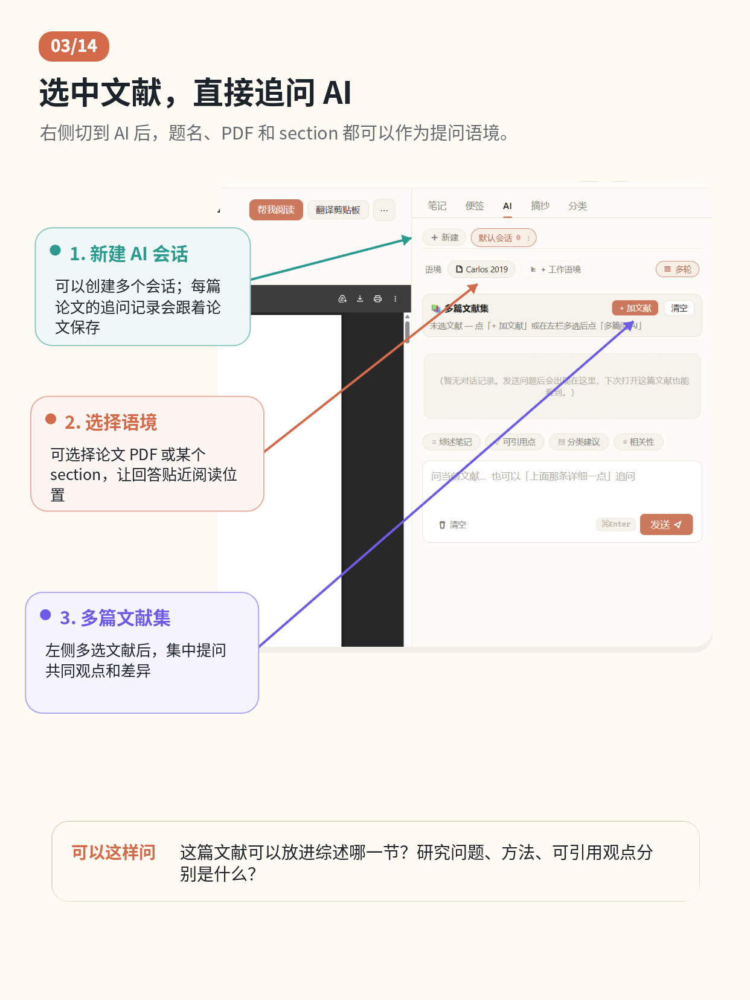 |
| 阅读 PDF 时生成速记、研究问题、方法数据和核心结论。 | 针对当前文献追问，或把它沉淀到某个写作项目的 citation 文件。 |

| 划词翻译 | 三层分类 |
| --- | --- |
| 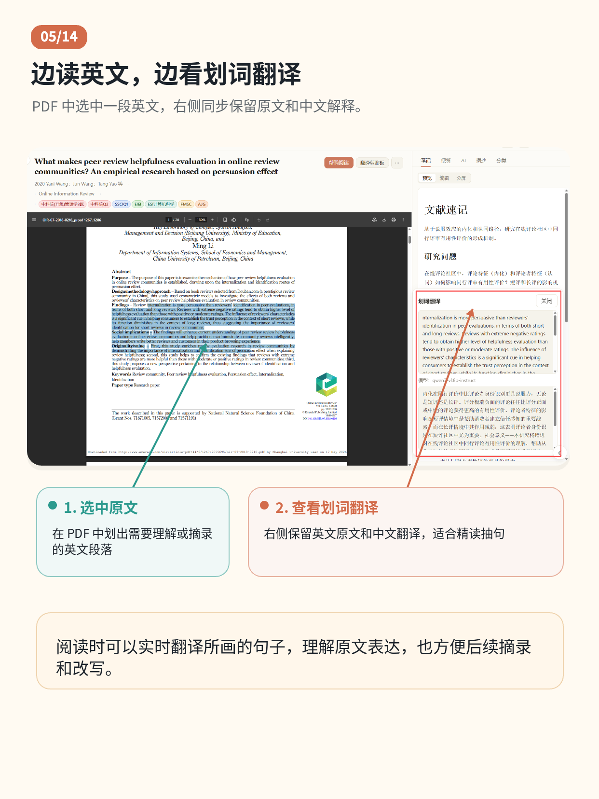 | 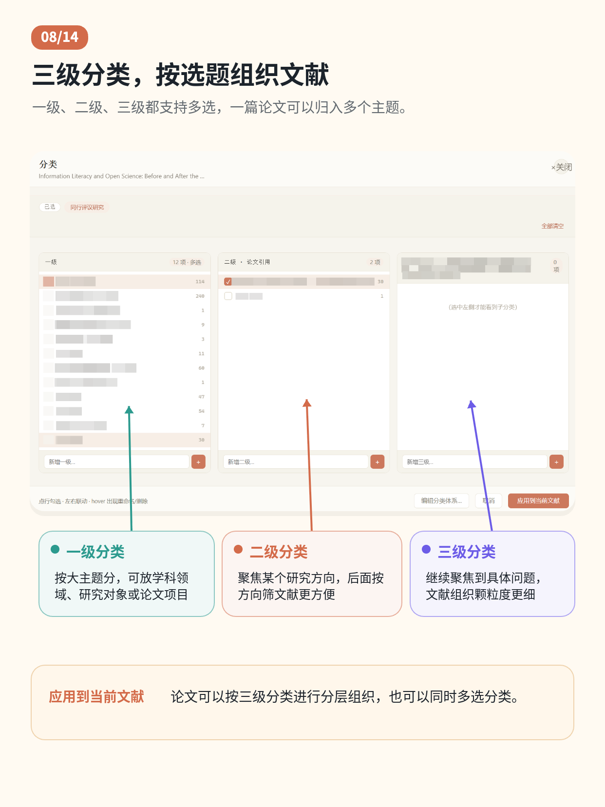 |
| 复制 PDF 里的文字后，在工作台内直接翻译。 | 支持一级多选、二级/三级分类、分类重命名和文献同步迁移。 |

| 作者图谱 | 模型配置 |
| --- | --- |
| 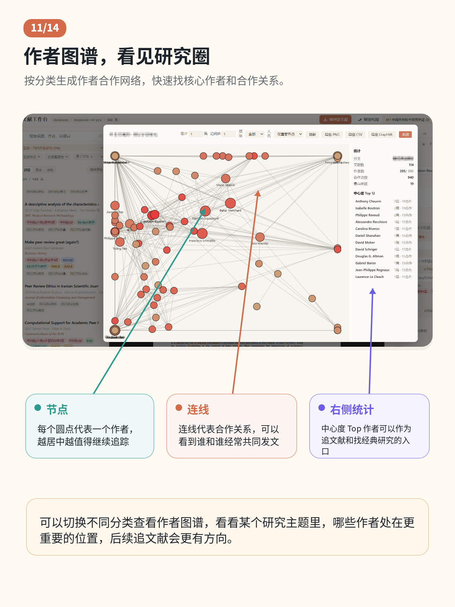 | 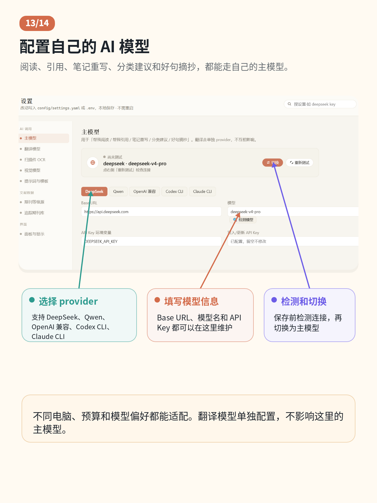 |
| 从文献列表里看作者关联，适合梳理主题网络。 | 在网页里配置 DeepSeek、Qwen、OpenAI-compatible、Codex CLI、Claude Code CLI 等。 |

<details>
<summary>展开完整图文导览</summary>

| 01 主界面 | 02 文献列表 |
| --- | --- |
|  | 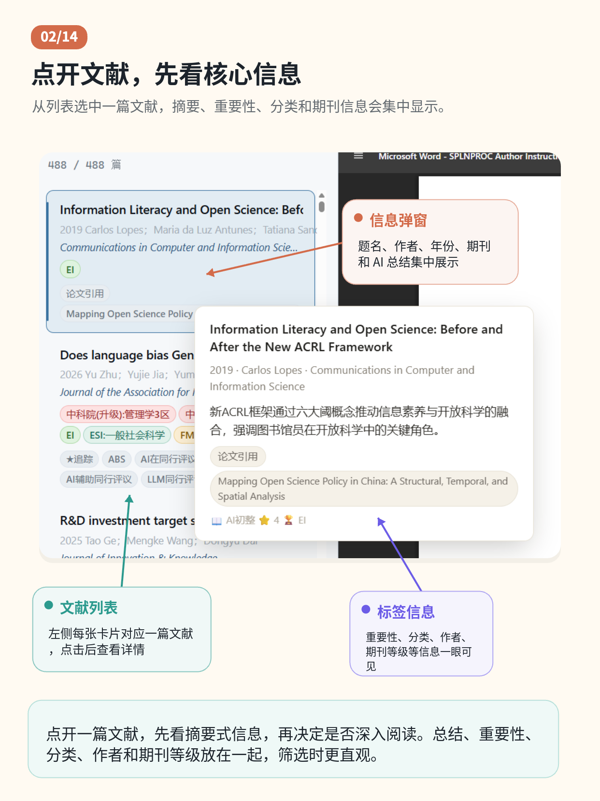 |

| 03 AI 追问 | 04 AI 笔记与引用 |
| --- | --- |
|  |  |

| 05 划词翻译 | 06 文献便签 |
| --- | --- |
|  | 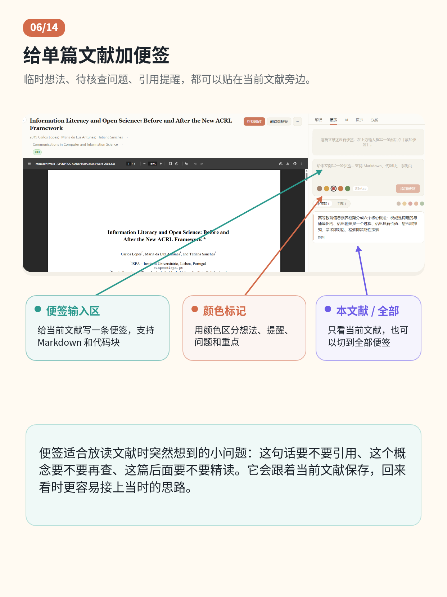 |

| 07 好句摘抄 | 08 三层分类 |
| --- | --- |
| 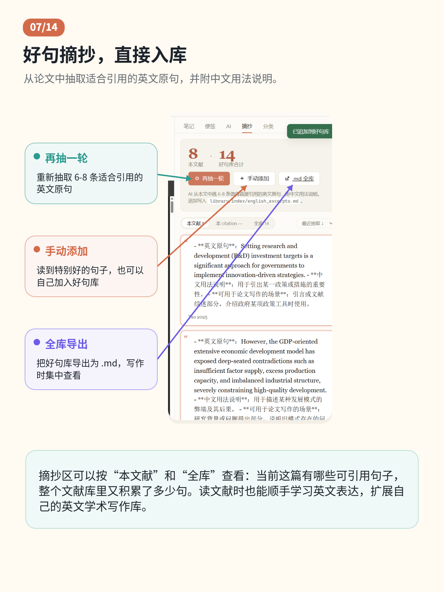 |  |

| 09 期刊分区 | 10 追踪期刊 |
| --- | --- |
| 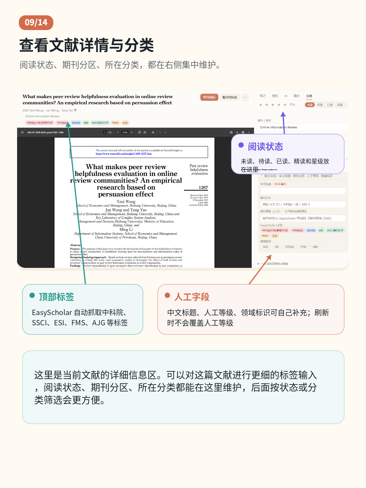 | 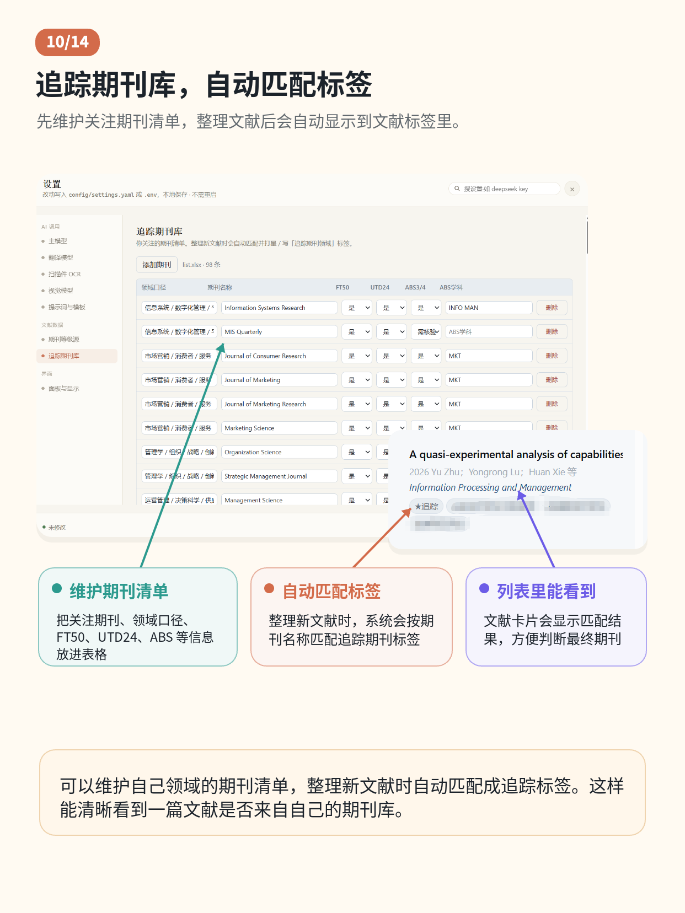 |

| 11 作者图谱 | 12 批量处理 |
| --- | --- |
|  | 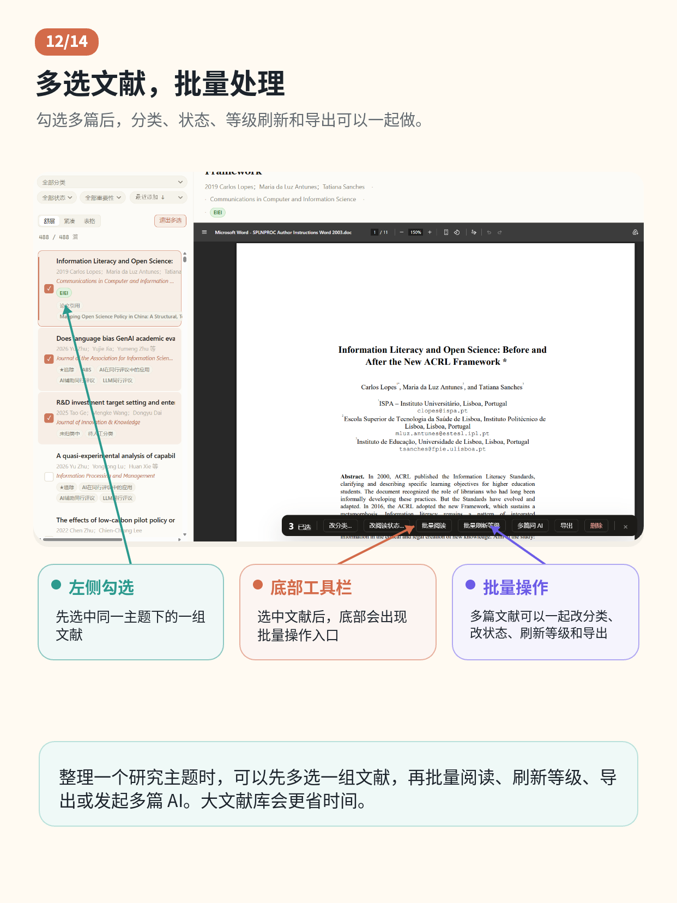 |

| 13 主模型配置 | 14 界面面板配置 |
| --- | --- |
|  | 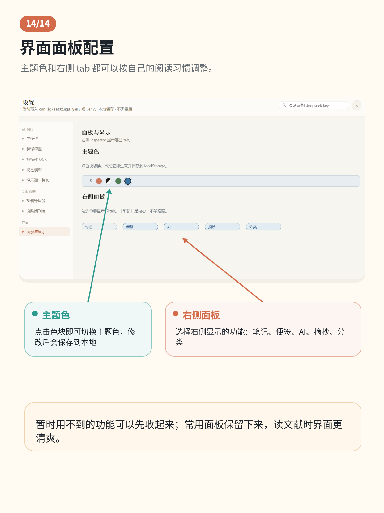 |

</details>

### 下载与打开

打开 [GitHub Releases](https://github.com/myppqk88/PP-Article-Library/releases)，下载对应系统：

- macOS: `PP-Article-Library-v0.2.4-macOS.zip`
- Windows: `PP-Article-Library-v0.2.4-Windows.zip`

当前版本仍需要你电脑上已有 Python 3.10+。Windows 安装 Python 时请勾选 `Add Python to PATH`。

### macOS 第一次打开

这个项目不做商业化，也没有购买 Apple Developer 签名和公证。macOS 可能会提示“Apple 无法验证 PP Article Library 是否包含恶意软件”。第一次打开时，推荐直接按下面操作，少走弯路：

如果你把文件解压在“下载”目录，复制这一整句到“终端 / Terminal”回车：

```bash
xattr -dr com.apple.quarantine "$HOME/Downloads/PP-Article-Library-v0.2.4-macOS" && open "$HOME/Downloads/PP-Article-Library-v0.2.4-macOS/PP Article Library.app"
```

如果你放在别的位置：

1. 打开“终端 / Terminal”。
2. 输入下面这句，然后按一下空格键：

```bash
xattr -dr com.apple.quarantine
```

3. 把整个 `PP-Article-Library-v0.2.4-macOS` 文件夹拖进终端窗口。
4. 按回车。
5. 再双击 `PP Article Library.app`。

启动后会打开一个 Terminal 进度窗口。第一次运行会显示 Python 检测、依赖安装和服务启动日志。看到浏览器打开后，不要关闭这个 Terminal 窗口；关闭窗口会停止本地工作台。

### Windows 第一次打开

1. 解压 `PP-Article-Library-v0.2.4-Windows.zip`。
2. 双击 `Start PP Article Library.bat`。
3. 首次运行会检测 Python 并安装必需依赖。
4. 浏览器会自动打开本地工作台。

如果提示找不到 Python，请安装 Python 3.10+，并勾选 `Add Python to PATH`。

### 首次运行会安装什么

首次运行只自动安装必需 Python 包：

- `PyYAML`
- `requests`
- `openpyxl`
- `PyMuPDF`
- `pypdf`

这些依赖会安装到项目文件夹里的 `.deps_macos` 或 `.deps_windows`，不会修改你的系统 Python。扫描件 OCR 的 `rapidocr` / `Pillow` 不会默认安装，需要 OCR 时可以再手动安装或配置云 OCR。

### 首次配置向导

浏览器第一次打开工作台时，如果还没有配置主 AI，会自动弹出「第一次使用配置向导」。它会引导你选择主模型、填写 API key、选择翻译方式（本地 Ollama / 欧拉或复用 API）、以及可选配置 EasyScholar、视觉模型和 OCR。

向导填入的 API key 会保存到本地 `.env`，其它选择会保存到 `config/settings.yaml`。以后想重新打开向导，可以点顶部「更多操作 → 配置向导」。

### API key 保存在哪里

你在网页「设置」里填写的 key 会写入项目根目录的 `.env` 文件。这个文件已被 `.gitignore` 排除，不会上传到 GitHub。

### 从 Zotero 导入

如果你已经用 Zotero 管理文献，不需要再手动重复整理。打开工作台后点顶部「更多操作 → 从 Zotero 导入」，程序会自动检测常见 Zotero 数据目录，也可以手动选择文件夹。

请选择包含 `zotero.sqlite` 的 Zotero 数据目录，不要选 `storage` 子文件夹。导入前会先预览可新增文献、重复文献、PDF、笔记和批注数量；确认后才会复制 PDF 到 `library/pdfs`，并把 Zotero 普通笔记 / PDF 批注整理成 Markdown 笔记。

这个功能只读 Zotero，不会修改你的 Zotero 数据库，也不需要 MCP。Zotero 开着也可以导入，程序会读取一个临时快照。

### 添加本地 PDF

打开工作台后点顶部「添加 PDF」，可以一次选择一个或多个本地 PDF。程序会先把它们复制到 `inbox/`，然后自动按原来的「整理新文献」流程生成索引和笔记。

### 数据在哪里

```text
.
├── inbox/             待整理 PDF
├── library/
│   ├── pdfs/          整理后的 PDF
│   ├── notes/         Markdown 笔记
│   ├── text/          PDF 文本缓存
│   ├── cache/         AI / EasyScholar 缓存
│   ├── stickies/      便签 JSON
│   └── index/         papers.csv / papers.xlsx
├── citations/         写作 citation 文件
├── config/            本地设置
├── prompts/           AI 提示词和笔记模板
├── scripts/           Python 后端
├── web/               浏览器前端
├── exports/           分类导出包
└── .env               API keys
```

`library/`、`inbox/`、`citations/`、`exports/`、`.env`、`config/settings.yaml` 都不会上传到公开仓库。

### 从源码启动

```bash
git clone https://github.com/myppqk88/PP-Article-Library.git
cd PP-Article-Library
python3 scripts/server.py
```

浏览器会打开 `http://127.0.0.1:8765`。

## English

PP Article Library is a local-first research workbench for personal literature management. It helps you organize PDFs, read papers, generate AI notes, classify papers, keep sticky notes and excerpts, and maintain citation context for writing projects.

### Download

Download the latest package from [GitHub Releases](https://github.com/myppqk88/PP-Article-Library/releases):

- macOS: `PP-Article-Library-v0.2.4-macOS.zip`
- Windows: `PP-Article-Library-v0.2.4-Windows.zip`

Python 3.10+ is still required. On Windows, install Python with `Add Python to PATH` enabled.

### First Launch On macOS

This app is not Apple Developer notarized. On first launch, macOS may block the downloaded app. If the folder is in Downloads, paste this into Terminal:

```bash
xattr -dr com.apple.quarantine "$HOME/Downloads/PP-Article-Library-v0.2.4-macOS" && open "$HOME/Downloads/PP-Article-Library-v0.2.4-macOS/PP Article Library.app"
```

If the folder is elsewhere, type `xattr -dr com.apple.quarantine ` in Terminal, drag the extracted `PP-Article-Library-v0.2.4-macOS` folder into Terminal, press Enter, then open `PP Article Library.app`.

The app opens a Terminal progress window. Keep it open while using the workbench; closing it stops the local server.

### First Launch On Windows

1. Extract `PP-Article-Library-v0.2.4-Windows.zip`.
2. Double-click `Start PP Article Library.bat`.
3. The launcher checks Python and installs required dependencies.
4. Your browser opens the local workbench.

### Run From Source

```bash
git clone https://github.com/myppqk88/PP-Article-Library.git
cd PP-Article-Library
python3 scripts/server.py
```

Then open `http://127.0.0.1:8765`.

### Import From Zotero

If you already manage papers in Zotero, open the workbench and choose `More → Import from Zotero`. Select the Zotero data directory that contains `zotero.sqlite`, not the `storage` subfolder.

The importer previews new items, duplicates, PDFs, notes, and annotations before it copies anything. On confirmation, it copies PDF files into `library/pdfs` and converts Zotero notes / PDF annotations into Markdown notes. It reads a temporary snapshot, so Zotero can stay open. It is read-only for Zotero and does not require MCP.

### Add Local PDFs

In the workbench, click `Add PDF` to choose one or more local PDF files. The app copies them into `inbox/` and then runs the normal organization flow.

### Privacy And Local Data

PDFs, notes, citation files, API keys, local settings, generated indexes, exports, and caches stay in your local folder by default. They are ignored by Git and are not included in the public repository.

### License

This project uses the [PolyForm Noncommercial License 1.0.0](LICENSE.md).

You may use, modify, and share it for noncommercial research, learning, teaching, public-interest, and educational purposes. Commercial use requires separate permission from the author.
